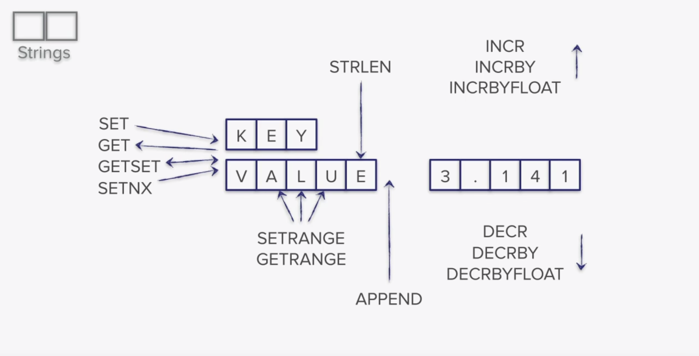
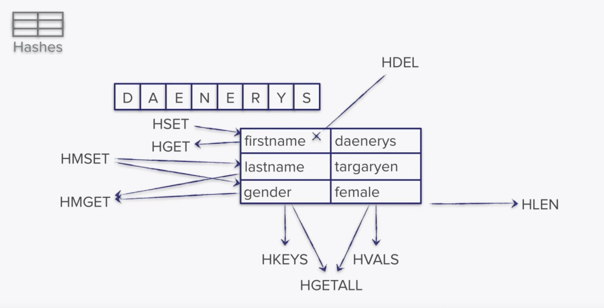
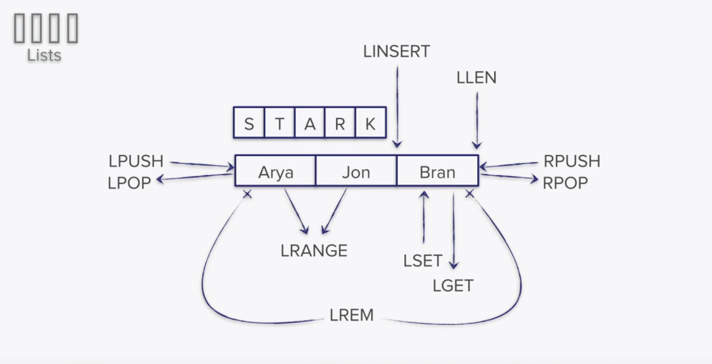
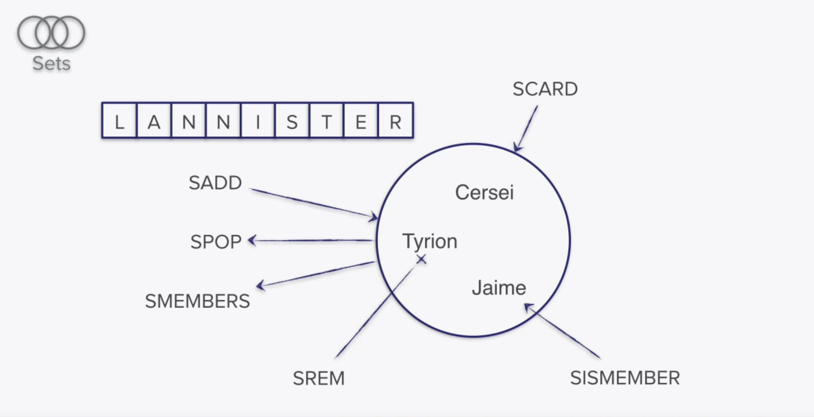
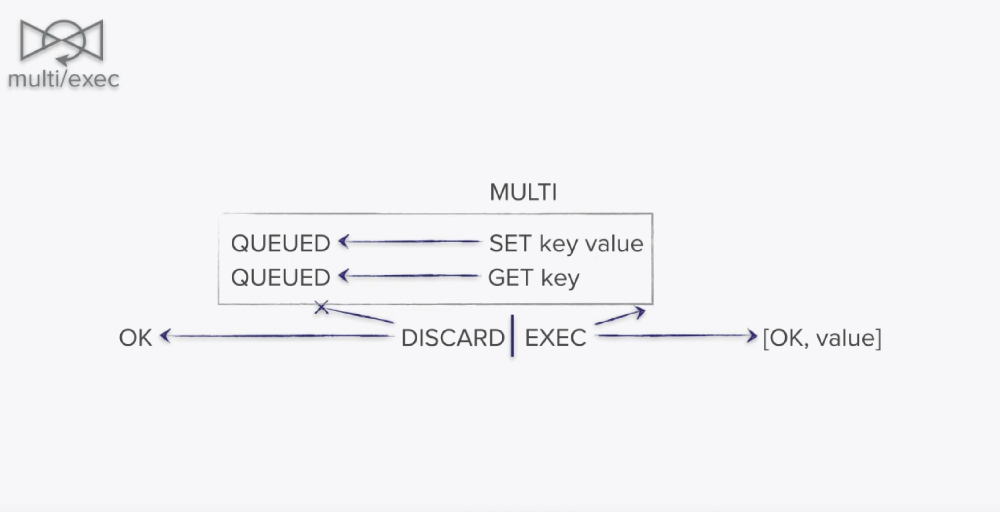

# redis getting started
Redis playground...

Travis CI build status: [](https://travis-ci.org/daggerok/redis-getting-started/)

GitHub [daggerok/redis-getting-started](https://github.com/daggerok/redis-getting-started/) repository

Read docs on [GitHub Pages](https://daggerok.github.io/redis-getting-started/)

## run database

```bash
docker run -d --rm --name redis redis:alpine
```

## prepare redis-cli command alias fot using docker

```bash
function redis-cli { bash -c "docker exec -it redis ash -c 'redis-cli $1'"; }
```

## basics

### show keys `keys`

```bash
redis-cli 'keys *'
# (empty list or set)
```

### set value `set`

```bash
redis-cli redis-cli 'set message hi'
# OK
```

### get value `get`

```bash
redis-cli 'get message'
# "hi"
redis-cli 'keys *'
# 1) "message"
```

### delete data `del`

```bash
redis-cli 'del message'
# (integer) 1
```

### delete all data `flushall`

```bash
redis-cli redis-cli 'set k1 v1'
redis-cli redis-cli 'set k2 v2'
 
redis-cli 'keys *'
# 1) "k2"
# 2) "k1"
redis-cli 'flushall'
# OK
redis-cli 'keys \*' # escaping star... in real terminal, command should be: redis-cli keys *
# (empty list or set)
```

### set value with expire of the key `setex`

```bash
redis-cli 'setex temporal 60 this-value-will-exire-after-60-secons'
# OK
redis-cli 'ttl temporal'
# (integer) 58
sleep 6s ; redis-cli 'get temporal'
# "this-value-will-exire-after-60-secons"
sleep 60s ; redis-cli 'get temporal'
# (nil)
redis-cli 'ttl temporal'
# (integer) -2
```

_NOTE: if you wanna set expire in millis, use `psetex` command instead:_

```bash
redis-cli 'psetex key milliseconds value'
```

### set value if key is not available with `setnx`

```bash
redis-cli 'get new-key'
# (nil)
redis-cli 'setnx new-key a-value'
# (integer) 1
redis-cli 'get new-key'
# "a-value"
redis-cli 'setnx new-key this-value-wont-be-present'
# (integer) 0
redis-cli 'get new-key'
# "a-value"
```

### get value size with `strlen` command

```bash
redis-cli 'set ololo trololo'
# OK
redis-cli 'strlen ololo'
# (integer) 7
```

### setting multiple key-values

```bash
redis-cli 'flushall'
# OK
redis-cli 'mset k1 v1 k2 v2 k3 v3'
# OK
redis-cli 'keys \*'
# 1) "k3"
# 2) "k2"
# 3) "k1"
```
 
_NOTE:  command `ttl` stands for `time to live`_

### increment with `incr` and decrement with `decr`  commands

```bash
redis-cli 'set salary 4444'
# OK
redis-cli 'decr salary'
# (integer) 4443
redis-cli 'incr salary'
# (integer) 4444
redis-cli 'incr salary'
# (integer) 4445
```

### customize previous flow with `incrby` / `decrby`

```bash
redis-cli 'set salary 1000'
# OK
redis-cli 'decrby salary 5'
# (integer) 995
redis-cli 'incrby salary 500'
# (integer) 1495
redis-cli 'incrby salary 100500'
# (integer) 101995
```

### append

```bash
redis-cli 'set message hello'
# OK
redis-cli 'append message -world!'
# (integer) 12
redis-cli 'get message'
# "hello-world!"
```



## hashes

Why? Limitations for strings (key-value pairs) are about 512 Mb.
But in case of hashes (field-value pairs) limits up to 4 billions field-value pairs

### set key field-value pair with `hmset`

```bash
redis-cli 'hmset person username maksimko password very-secret'
# OK
redis-cli 'hget person password'
# "very-secret"
redis-cli 'hmget person password'
# 1) "very-secret"
redis-cli 'hgetall person'
# 1) "username"
# 2) "maksimko"
# 3) "password"
# 4) "very-secret"
```

### `hexists`

```bash
redis-cli 'hexists person age'
# (integer) 0
redis-cli 'hexists person username'
# (integer) 1
```

_age dose not exists in person object_

### `hdel`

```bash
redis-cli 'hdel person password'
# (integer) 1
redis-cli 'hgetall person'
# 1) "username"
# 2) "maksimko"
```

### `hsetnx`

set field value if it's does not exists

```bash
redis-cli 'hsetnx person age 18' # will set new field
# (integer) 1
redis-cli 'hsetnx person age 19' # will ignore because age field already exists
# (integer) 0
```

### `hkeys`

```bash
redis-cli 'hkeys person'
# 1) "username"
# 2) "age"
```

_NOTE: returns only key fields of object_

### `hincrby` similar to strings

```bash
redis-cli 'hincrby person age 1'
# (integer) 19
redis-cli 'hincrby person age 5'
# (integer) 24
```

### others

```bash
redis-cli 'hstrlen person username'
# (integer) 8
redis-cli  'hvals person'
# 1) "maksimko"
# 2) "24"
redis-cli 'hlen person' # number of fields in object hash
# (integer) 2
redis-cli 'hmget person username age'
# 1) "maksimko"
# 2) "24"
```



## list

strings sorted in a some order

```bash
head <--> value1 <--> value2 <--> ... <--> valueN <--> tail
```

### debug redis-cli

```bash
redis-cli 'monitor'
```

### and do playground in a parallel terminal...

```bash
# create: my-list = List(3 2 1 0)
redis-cli 'lpush my-list 0 1 2 3'

# show first 10 elements of my-list moving from left to right
redis-cli 'lrange my-list 0 10'

# add 4 and 5 from left: List(5 4 3 2 1)
redis-cli 'lpush my-list 4 5'

# take out 1st left element ("5") from list: List(4 3 2 1)
redis-cli 'lpop my-list'

# update to palindrome: List(4 3 2 1 0 1 2 3 4)
redis-cli 'rpush my-list 0 1 2 3 4'

# show list items from 0th index till 10th index
redis-cli 'lrange my-list 0 10'

# show el of index 3 (4th element moving from left to right): "1"
redis-cli 'lindex my-list 3'

# set el in a middle to "X": List(4 3 2 1 X 1 2 3 4) 
redis-cli 'lset my-list 4 X'

# show whole list (from begin: 0, to last: -1)
redis-cli 'lrange my-list 0 -1'

# this will be not push because list does not exists 
redis-cli 'lpushx skip this one - it does not exists'

# but this will push both elements: List(6 5 4 3 2 1 X 1 2 3 4 5 6)
redis-cli 'lpushx my-list 5 6'
redis-cli 'rpushx my-list 5 6'

# insert XX to make XXX in a middle
redis-cli 'linsert my-list after X X' #  List(6 5 4 3 2 1 X X 1 2 3 4 5 6)
redis-cli 'linsert my-list before X X' # List(6 5 4 3 2 1 X X X 1 2 3 4 5 6)
```



## sets

```bash
# create: my-set = Set(one two three)
redis-cli 'sadd my-set one two three'

# view
redis-cli 'smembers my-set'
# 1) "two"
# 2) "one"
# 3) "three"

redis-cli 'sadd my-other-set two three four'
redis-cli 'sdiff my-set my-other-set'
# 1) "one"
redis-cli 'sdiff my-other-set my-set'
# 1) "four"

redis-cli 'sunion my-other-set my-set'
# 1) "two"
# 2) "one"
# 3) "three"
# 4) "four"

redis-cli 'sunionstore result-set my-other-set my-set'
redis-cli 'smembers result-set'
# 1) "two"
# 2) "one"
# 3) "three"
# 4) "four"

redis-cli 'srem result-set four'
redis-cli 'smembers result-set'
# 1) "two"
# 2) "one"
# 3) "three"

# remove last value from result-set
redis-cli 'spop result-set'
# 3) "three"

redis-cli 'sadd result-set ololo trololo hohoho'
# remove random 2 values from result-set
redis-cli 'spop result-set 2'
# 1) "ololo"
# 2) "two"
redis-cli 'smembers result-set'
# 1) "one"
# 2) "hohoho"
# 3) "trololo"
```

also see: `sinter` - intersection and `smove` - move value from some set to another...



## transactions



okay, enough...

## cleanup

```bash
docker rm -f -v redis
```

## build VuePress documentation

```bash
npm i ; npm run build
```
